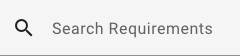
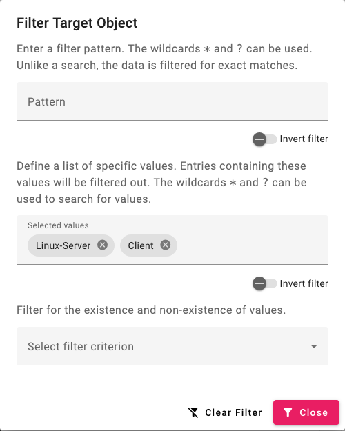
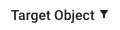
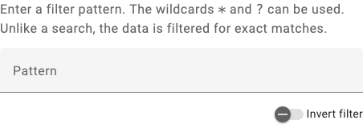
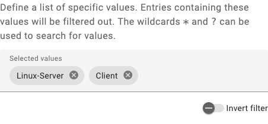
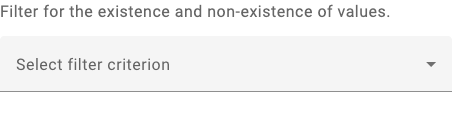

.. _sortieren:

#####################
Filtern und Sortieren
#####################

Das MV-Tool bietet die Möglichkeit, Tabelleneinträge zu filtern und zu
sortieren. Diese Funktionen erleichtern die Handhabung großer Datenmengen, indem
sie das Auffinden spezifischer Einträge beschleunigen und die Darstellung nach
bestimmten Kriterien ordnen.

Sortieren
#########

Ein kleiner Sortierbutton (:guilabel:`↑` oder :guilabel:`↓`) erscheint rechts
neben den Spaltenüberschriften, sobald Sie mit der Maus darüberfahren. Dieser
ermöglicht es Ihnen, die Tabelle nach der entsprechenden Spalte zu sortieren.
Ein Klick auf den Button aktiviert die Sortierung. Ein weiterer Klick auf den
Button ändert die Sortierrichtung oder hebt die Sortierung auf.

Bitte beachten Sie, dass Sie immer nur nach einer Spalte zur gleichen Zeit
sortieren können. Ohne Sortierung erscheinen die Einträge in ihrer
ursprünglichen Reihenfolge, wie sie im MV-Tool angelegt wurden.

.. _suche:

Suchen
######

Das Suchfeld befindet sich über der Tabelle und ermöglicht das Durchsuchen der
Tabelle nach einem bestimmten Text. Die Suche ist nicht auf eine bestimmte
Spalte begrenzt und durchsucht alle Spalten mit Textinhalt.

Wenn Sie :ref:`Filter <filtern>` angewendet haben, beschränkt sich die Suche auf
die gefilterten Einträge.

.. hint::

    Die Suche unterscheidet nicht zwischen Groß- und Kleinschreibung. Mit
    Wildcards können Sie Ihre Suche verfeinern: Ein Stern ``*`` steht für
    beliebig viele Zeichen, während ein Fragezeichen ``?`` ein einzelnes Zeichen
    repräsentiert.

Filtern
#######

Bei Spalten, die filterbare Werte enthalten, wird der :guilabel:`Click to
filter` angezeigt, wenn Sie mit der Maus über die Spaltenüberschrift fahren. Ein
Klick auf die Spaltenüberschrift öffnet dann den Filterdialog. Sie können
gleichzeitig mehrere Spalten filtern.

Der Filterdialog kann je nach Spaltentyp variieren und verschiedene Arten von
Filtern enthalten, die im Folgenden beschrieben werden. Sie können Filter
individuell oder kombiniert anwenden und müssen sie nicht speichern. Sie werden
direkt angewendet, was Ihnen hilft, schnell zu sehen, ob sie die gewünschten
Ergebnisse liefern.

Zum Zurücksetzen des Filterdialogs klicken Sie auf den Button :guilabel:`Clear
filter`.

Wenn ein Filter auf einer Spalte angewendet ist, erscheint ein kleines Icon
rechts neben der Spaltenüberschrift.

Filtern nach Wildcards
======================

In textbasierten Spalten können Sie Wildcards für die Filterung nutzen. Ein
Stern ``*`` steht für eine beliebige Anzahl von Zeichen, ein Fragezeichen ``?``
für ein einzelnes Zeichen. Die Groß- und Kleinschreibung wird nicht
berücksichtigt.

.. hint::

    Wildcard-Filter funktionieren anders als die :ref:`Suche <suche>`. Beim
    Filtern mit Wildcards werden nur Einträge angezeigt, die exakt auf das
    angebene Muster passen. Wenn Sie einen Teilstring suchen möchten, müssen Sie
    daher Ihre Eingabe mit Sternen an Anfang und Ende versehen (z.B.
    ``*Teilstring*``).

Filtern nach Werten
===================

Spalten mit begrenzten Wertemengen können nach diesen Werten gefiltert werden.
Geben Sie die Werte in das Eingabefeld ein und eine Liste mit passenden
Vorschlägen erscheint. Mit der Maus oder den Pfeiltasten :kbd:`↑` :kbd:`↓`
können Sie einen Wert auswählen. Bestätigen Sie Ihre Auswahl mit einem Klick
oder der :kbd:`Return`-Taste.

Wenn Sie mehrere Werte auswählen, zeigt die Tabelle nur die Einträge, die einen
der ausgewählten Werte enthalten.

Filtern nach Existenz von Werten
================================

Um alle Einträge anzuzeigen, die einen Wert in einer bestimmten Spalte haben
(oder umgekehrt, die keinen Wert in dieser Spalte haben), können Sie den
Existenz-Filter verwenden. Das Dropdown-Menü bietet folgende Optionen:

- :guilabel:`None`: Die Standardeinstellung, bei der kein Filter angewendet wird.
- :guilabel:`Non-empty`: Zeigt nur Einträge an, die einen Wert in der Spalte haben.
- :guilabel:`Empty`: Zeigt nur Einträge an, die keinen Wert in der Spalte haben.
