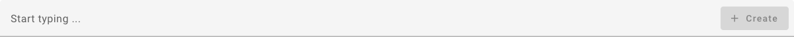

.. _projects:

########
Projekte
########

Bevor Sie mit dem MV-Tool arbeiten können, müssen Sie ein Projekt anlegen. Ein
Projekt in diesem Kontext ist eine Sammlung von :ref:`Anforderungen
<anforderungen>`, denen :ref:`Maßnahmen <massnahmen>` zugeordnet werden können.
Darüber hinaus kann ein Projekt auch :ref:`Dokumente <dokumente>` enthalten, die
ebenfalls Maßnahmen zugeordnet werden können.

Zum Anlegen eines Projekts, navigieren Sie zuerst zur Übersichtsseite aller
Projekte. Klicken Sie hierfür in der :ref:`navigation` auf den Button
:guilabel:`Projects`. Es wird eine Tabelle aller Projekte angezeigt. Wenn Sie
noch kein Projekt erstellt haben, ist diese Tabelle leer.

.. _create_project:

Projekte anlegen
################

Um ein neues Projekt anzulegen, klicken Sie auf den Button :guilabel:`Create
Project` oberhalb der Projekttabelle. Es öffnet sich ein Dialog, in dem Sie
die Details für Ihr neues Projekt eingeben können:

.. list-table::
   :header-rows: 1

   * - 
     - Beschreibung
     - Erforderlich
   * - :guilabel:`Name`
     - Geben Sie einen aussagekräftigen Namen für Ihr Projekt ein.
     - Ja
   * - :guilabel:`Description`
     - Beschreiben Sie kurz das Projekt und seine Ziele.
     - 
   * - :guilabel:`JIRA Project`
     - Falls Ihr Projekt mit einem JIRA-Projekt verknüpft werden soll, können
       Sie es hier auswählen. Eventuelle Tickets, die durch das MV-Tool für die
       Maßnahmen dieses Projekts erstellt werden, werden dann in dem
       ausgewählten JIRA-Projekt erstellt.
     - 

Bestätigen Sie Ihre Eingaben durch Klicken auf den Button :guilabel:`Save`. Ihr
neu erstelltes Projekt wird dann in der Projekttabelle angezeigt.

.. note::

    Sie können die Details Ihres Projekts jederzeit ändern. Verwenden Sie hierzu
    die :ref:`Eintrag-spezifischen Funktionen <eintrag-spezifische-funktionen>`
    des MV-Tools.

Projekt öffnen
##############

Um in einem bestimmten Projekt zu arbeiten, müssen Sie dieses öffnen. Klicken
Sie dafür einfach auf den Namen des gewünschten Projekts in der Projekttabelle.

.. _anforderungen:

Anforderungen
#############

Um die Anforderungen eines Projekts anzuzeigen, navigieren Sie zuerst zur
:ref:`Projekttabelle <projects>`. Klicken Sie dann auf das Projekt, dessen
Anforderungen Sie sehen möchten. Stellen Sie sicher, dass
:guilabel:`Requirements` als letzter Eintrag in der 
:ref:`Brotkrümel-Navigation <breadcrumbs>` ausgewählt ist. Daraufhin wird eine
Tabelle mit allen Anforderungen des gewählten Projekts angezeigt.

Anforderung anlegen
===================

Um eine neue Anforderung anzulegen, klicken Sie auf den Button 
:guilabel:`Create Requirement` oberhalb der Anforderungstabelle. Es öffnet sich
ein Dialogfeld, in dem Sie die Details für die neue Anforderung eingeben können:

.. list-table::
   :header-rows: 1

   * - 
     - Beschreibung
     - Erforderlich
   * - :guilabel:`Reference`
     - Vergeben Sie eine eindeutige Kennung für Ihre Anforderung.
     - 
   * - :guilabel:`Summary`
     - Verfassen Sie eine prägnante Zusammenfassung Ihrer Anforderung. Dies kann
       ein Satz oder eine Liste von Stichworten sein.
     - Ja
   * - :guilabel:`Description`
     - Beschreiben Sie hier ausführlich den Inhalt Ihrer Anforderung,
       insbesondere dann, wenn er aus der Zusammenfassung nicht klar hervorgeht.
     - 
   * - :guilabel:`Milestone`
     - Definieren Sie hier einen Meilenstein, zu dem Sie die Anforderung
       umgesetzt haben möchten.
     - 
   * - :guilabel:`Target object`
     - Wählen Sie hier ein Zielobjekt aus, auf das sich die Anforderung bezieht.
       In der Regel handelt es sich dabei um eine spezifische IT-Infrastruktur
       oder eine Gruppe von IT-Infrastrukturen.
     - 

Bestätigen Sie Ihre Eingaben durch Klicken auf den Button :guilabel:`Save`. Die
neu erstellte Anforderung wird dann in der Übersichtsliste der Anforderungen
angezeigt.

.. note::

    Die Details einer Anforderung können jederzeit bearbeitet werden. Verwenden
    Sie dazu die :ref:`Eintrag-spezifischen Funktionen
    <eintrag-spezifische-funktionen>` des MV-Tools. Darüber hinaus können Sie
    den :ref:`Erfüllungsgrad <compliance>` Ihrer Anforderung definieren.

.. _dokumente:

Dokumente
#########

Um die Dokumente eines Projekts anzuzeigen, navigieren Sie zur :ref:`Tabelle der
Projekte <projects>` und klicken auf das entsprechende Projekt. Stellen Sie
sicher, dass in der :ref:`breadcrumbs` :guilabel:`Documents` ausgewählt
ist. Falls dies nicht der Fall ist, klicken Sie auf den letzten Eintrag in der
:ref:`breadcrumbs` Leiste und wählen aus dem Dropdown-Menü
:guilabel:`Documents`. Anschließend wird eine Tabelle mit allen Dokumenten des
ausgewählten Projekts dargestellt.

Dokument anlegen
================

Um ein neues Dokument anzulegen, klicken Sie auf den Button 
:guilabel:`Create Document` oberhalb der Dokumententabelle. Ein Dialog öffnet
sich, in dem Sie die Details für das neue Dokument eingeben können:

.. list-table::
   :header-rows: 1

   * - 
     - Beschreibung
     - Erforderlich
   * - :guilabel:`Reference`
     - Vergeben Sie eine eindeutige Kennung für Ihr Dokument (z.B. eine
       Dokumentennummer).
     - 
   * - :guilabel:`Titel`
     - Geben Sie einen aussagekräftigen Titel für Ihr Dokument an.
     - Ja
   * - :guilabel:`Description`
     - Beschreiben Sie hier Ihr Dokument kurz und prägnant.
     - 

Bestätigen Sie Ihre Eingaben durch Klicken auf den Button :guilabel:`Save`. Das
neu erstellte Dokument wird dann in der Dokumententabelle der Dokumente
angezeigt.

.. note::

    Sie können die Informationen eines Dokuments jederzeit bearbeiten. Verwenden
    Sie dazu die :ref:`Eintrag-spezifischen Funktionen
    <eintrag-spezifische-funktionen>` des MV-Tools.

.. _massnahmen:

Maßnahmen
#########

Sie können die Maßnahmen eines Projekts auf zwei Arten anzeigen:

* Navigieren Sie zur :ref:`Tabelle der Projekte <projects>` und klicken Sie auf
  das betreffende Projekt. Stellen Sie sicher, dass in der :ref:`breadcrumbs`
  :guilabel:`Measures` ausgewählt ist. Daraufhin wird eine Tabelle mit allen
  Maßnahmen des Projekts dargestellt.
* Alternativ können Sie in der :ref:`Tabelle der Anforderungen <anforderungen>`
  auf die spezifische Anforderung klicken, für die Sie die Maßnahmen anzeigen
  möchten. Sie erhalten dann eine Übersicht aller mit dieser Anforderung
  verknüpften Maßnahmen.

Maßnahme anlegen
================

Um eine neue Maßnahme zu erstellen, klicken Sie auf den Button 
:guilabel:`Create Measure` oberhalb der Maßnahmentabelle. Ein Dialog öffnet
sich, in dem Sie die Details für die neue Maßnahme eingeben können:

.. list-table::
   :header-rows: 1

   * - 
     - Beschreibung
     - Erforderlich
   * - :guilabel:`Reference`
     - Vergeben Sie eine eindeutige Kennung für Ihre Maßnahme.
     - 
   * - :guilabel:`Summary`
     - Geben Sie eine prägnante Zusammenfassung für Ihre Maßnahme an. Dies
       könnte ein vollständiger Satz oder nur einige Schlüsselwörter sein.
     - Ja
   * - :guilabel:`Description`
     - Hier können Sie weitere Details zu Ihrer Maßnahme eingeben, falls diese
       aus der Zusammenfassung nicht klar ersichtlich sind.
     - 
   * - :guilabel:`Document`
     - Wenn vorhanden, wählen Sie ein Dokument aus, das mit der Maßnahme
       verknüpft werden soll. Dies beinhaltet gewöhnlich Details, wie die
       Maßnahme im ausgewählten Dokument beschrieben oder dokumentiert ist.
     - 

Bestätigen Sie Ihre Eingaben mit dem Button :guilabel:`Save`. Die neu erstellte
Maßnahme wird dann in der Maßnahmentabelle angezeigt.

-----------------

Alternativ können Sie eine Maßnahme über die Schnell-Eingabe erstellen, die als
letzter Eintrag in der Maßnahmentabelle angezeigt wird. Geben Sie einfach die
Zusammenfassung der Maßnahme in das Eingabefeld ein und bestätigen Sie Ihre
Eingabe mit der :kbd:`Enter`-Taste oder durch Klicken auf den Button
:guilabel:`Create`.

.. note::

    Die Details einer Maßnahme können jederzeit bearbeitet werden. Verwenden Sie
    dafür die :ref:`Eintrag-spezifischen Funktionen
    <eintrag-spezifische-funktionen>` des MV-Tools. Darüber hinaus können Sie
    den :ref:`Erfüllungsgrad <compliance>`, :ref:`Umsetzungsstand <umsetzung>`
    und den :ref:`Überprüfungsstatus <verification>` Ihrer Maßnahme festlegen
    oder ein :ref:`Jira-Ticket <jira_issues>` zu Ihrer Maßnahme erstellen.

.. hint::

    Bitte beachten Sie, dass neue Maßnahmen nur zu einer bestehenden Anforderung
    angelegt werden können. Aus diesem Grund ist der Button
    :guilabel:`Create Measure` in der Maßnahmentabelle auf Projektebene nicht
    vorhanden.
