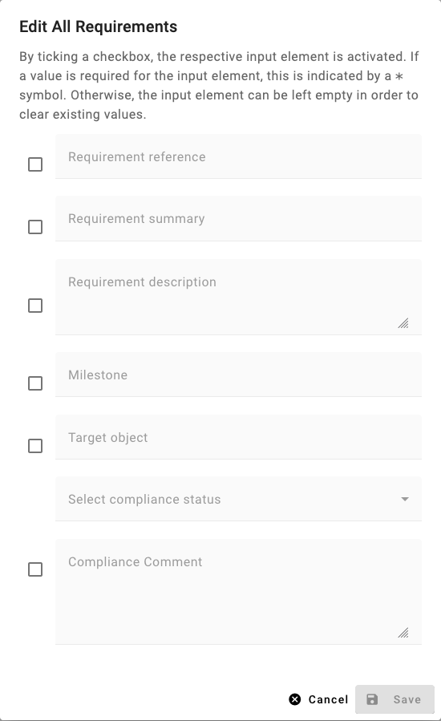
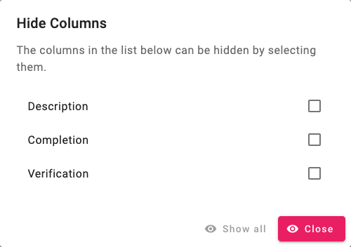

##################
Tabellenfunktionen
##################

Im MV-Tool werden viele Daten in Tabellenform dargestellt. Diese Tabellen bieten
zahlreiche Funktionen, die im Folgenden detailliert beschrieben werden.

Funktionen für die gesamte Tabelle
###################################

In der oberen rechten Ecke jeder Tabelle befindet sich ein Button :guilabel:`⋮`.
Wenn Sie auf diesen Button klicken, öffnet sich ein Menü mit Funktionen, die
sich auf die gesamte Tabelle und ihre Einträge beziehen.

Mehrfachbearbeitung
===================

Die Option :menuselection:`⋮ --> Edit all` öffnet einen Dialog zur
Mehrfachbearbeitung. Hier haben Sie die Möglichkeit, mehrere Einträge
gleichzeitig zu bearbeiten. Standardmäßig werden alle Einträge der Tabelle
berücksichtigt.

Folgen Sie diesen Schritten, um mehrere Einträge gleichzeitig zu bearbeiten:

1. Markieren Sie die Checkbox neben dem Datenfeld, das Sie bearbeiten möchten.
2. Geben Sie einen Wert in das Datenfeld ein. Falls das Datenfeld optional ist
   (d.h., es ist nicht mit einem ``*`` markiert), können Sie das Feld auch leer
   lassen. In diesem Fall wird der Wert des Datenfeldes für die bearbeiteten
   Einträge gelöscht.
3. Klicken Sie auf den Button :guilabel:`OK`, um die Änderungen zu speichern.

.. hint::

    Bitte beachten Sie, dass einige Datenfelder nur in Kombination mit anderen
    zugehörigen Datenfeldern bearbeitet werden können. Dies erkennen Sie daran,
    dass die Aktivierung einer Checkbox mehrere Datenfelder betrifft.

Bearbeiten von gefilterten Einträgen
------------------------------------

Sie haben auch die Möglichkeit nur gefilterte Einträge zu bearbeiten. Hierzu
setzen Sie einen :ref:`Filter <filtern>` auf eine oder mehrere Tabellenspalten.
In diesem Fall ändert sich die Option zu :menuselection:`⋮ --> Edit filtered`
und es werden nur die Einträge bearbeitet, die dem Filter entsprechen.

Bearbeiten von markierten Einträgen
-----------------------------------

Wenn Sie nur bestimmte Einträge bearbeiten möchten, können Sie diese
:ref:`markieren <markieren>`. In diesem Fall werden nur die markierten Einträge
bearbeitet und die Option ändert sich in  :menuselection:`⋮ --> Edit marked`.

.. note::

    Wenn Sie sowohl einen Filter als auch Markierungen gesetzt haben, werden nur
    die Einträge bearbeitet, die sowohl dem Filter als auch der Markierung
    entsprechen.

Spalten ausblenden
==================

.. TODO: Ggf. erwähnen, dass sich nur optionale Spalten ausblenden lassen.

Mit der Option :menuselection:`⋮ --> Hide columns` können Sie bestimmte Spalten
in der Tabelle ausblenden. Ein Dialogfenster öffnet sich, in dem Sie die zu
ausblendenden Spalten durch Markieren der Checkbox neben dem Spaltennamen
auswählen können. Diese Spalten werden anschließend nicht mehr in der Tabelle
angezeigt. Um die Spalten wieder einzublenden, öffnen Sie den Dialog erneut und
heben Sie die Auswahl auf.

Filter aufheben
===============

die Option :menuselection:`⋮ --> Clear all filters` ermöglicht Ihnen das
Aufheben aller :ref:`Filter <filtern>`, die Sie in der Tabelle gesetzt haben.
Diese Option ist nur aktiv, wenn mindestens ein Filter aktiv ist.

Sortierung aufheben
===================

Die Option :menuselection:`⋮ --> Clear sort` hebt die aktuelle :ref:`Sortierung
<sortieren>` der Tabelleneinträge auf. Diese Option ist nur verfügbar, wenn die
Tabelleneinträge sortiert sind.

Markierungen aufheben
=====================

Mit der Option :menuselection:`⋮ --> Clear markers` können Sie alle Markierungen
aufheben, die Sie in der Tabelle gesetzt haben. Diese Option ist nur aktiv, wenn
mindestens ein Eintrag markiert ist.

.. hint::

    Falls sich Filter und Markierungen überschneiden, kann es vorkommen, dass
    markierte Einträge nicht sichtbar sind, obwohl sie vorhanden sind. Dies
    erkennen Sie daran, dass die Option zum Aufheben der Markierung aktiv ist,
    obwohl keine markierten Einträge sichtbar sind.

Mehrfachlöschung
================

Mit der Option :menuselection:`⋮ --> Delete all` können Sie alle Einträge in der
Tabelle löschen. Diese Option ist nur aktiv, wenn die Tabelle Einträge enthält.
Wenn Sie nur bestimmte Einträge löschen möchten, können Sie diese filtern oder
markieren und dann :menuselection:`⋮ --> Delete filtered` bzw. :menuselection:`⋮
--> Delete marked` auswählen.

Es öffnet sich ein Bestätigungsdialog zur Löschung. Klicken Sie auf
:guilabel:`OK`, um die Löschung durchzuführen.

.. warning::

    Bitte beachten Sie, dass gelöschte Einträge nicht wiederhergestellt werden
    können. Stellen Sie sicher, dass Sie die richtigen Einträge zur Löschung
    ausgewählt haben.

.. _eintrag-spezifische-funktionen:

Eintrag-spezifische Funktionen
##############################

Jeder Tabelleneintrag verfügt über verschiedene Funktionen, die Sie durch
Anklicken des :guilabel:`⋮` Buttons am Ende jeder Zeile aufrufen können.

.. note::

    Abhängig vom Typ des Eintrags können im Menü zusätzliche Optionen zur
    Verfügung stehen, die sich auf den Prozess der Maßnahmenverfolgung beziehen,
    wie in :ref:`prozess` beschrieben.

Eintrag bearbeiten
==================

Die Option :menuselection:`⋮ --> Edit` ermöglicht es Ihnen, den ausgewählten
Eintrag zu bearbeiten. Ein Dialogfenster mit den Datenfeldern des Eintrags wird
geöffnet. Sie können die Datenfelder bearbeiten und die Änderungen durch Klicken
auf :guilabel:`Save` speichern.

Eintrag löschen
===============

Mit der Option :menuselection:`⋮ --> Delete` können Sie den ausgewählten Eintrag
löschen. Ein Bestätigungsdialog öffnet sich. Klicken Sie auf :guilabel:`OK`, um
den Eintrag zu löschen.

.. warning::

    Gelöschte Einträge können nicht wiederhergestellt werden. Stellen Sie
    sicher, dass Sie den richtigen Eintrag zum Löschen ausgewählt haben.

.. _markieren:

Eintrag markieren
=================

Die Option :menuselection:`⋮ --> Mark` ermöglicht es Ihnen, den ausgewählten
Eintrag zu markieren. Markierte Einträge werden in der Tabelle farblich
hervorgehoben. Sie können mehrere Einträge markieren, indem Sie die Markierung
für jeden Eintrag einzeln setzen.

Ist ein Eintrag markiert, ändert sich die Option zu :menuselection:`⋮ -->
Unmark`, über die Sie die Markierung wieder aufheben können.

.. warning::

    Beachten Sie, dass Markierungen nicht serverseitig gespeichert, sondern
    lediglich in der URL kodiert sind. Beim Schließen des Browserfensters können
    diese Markierungen verloren gehen.
